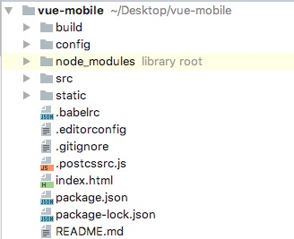

#VUE移动项目构建日志
##脚手架创建项目
`vue init webpack vue-mobile`
###项目基本配置
	? Project name vue-mobile
	? Project description A Vue.js project
	? Author zhang
	? Vue build standalone
	? Install vue-router? Yes
	? Use ESLint to lint your code? No
	? Set up unit tests No
	? Setup e2e tests with Nightwatch? No
	? Should we run `npm install` for you after the project has been created? (recommended) npm
	
###安装过程日志
	vue-cli · Generated "vue-mobile".
	
	
	# Installing project dependencies ...
	# ========================
	
	
	> fsevents@1.1.3 install /Users/zhang/Desktop/vue-mobile/node_modules/fsevents
	> node install
	
	[fsevents] Success: "/Users/zhang/Desktop/vue-mobile/node_modules/fsevents/lib/binding/Release/node-v59-darwin-x64/fse.node" is installed via remote
	
	> uglifyjs-webpack-plugin@0.4.6 postinstall /Users/zhang/Desktop/vue-mobile/node_modules/webpack/node_modules/uglifyjs-webpack-plugin
	> node lib/post_install.js
	
	npm notice created a lockfile as package-lock.json. You should commit this file.
	added 1106 packages in 32.161s
	
	# Project initialization finished!
	# ========================
	
	To get started:
	
	  cd vue-mobile
	  npm run dev
	
	Documentation can be found at https://vuejs-templates.github.io/webpack	
###初始的项目结构

>shell-log.md - 本篇说明

##安装json-server
`npm install -g json-server`

###安装过程日志
	/usr/local/bin/json-server -> /usr/local/lib/node_modules/json-server/bin/index.js
	+ json-server@0.12.1
	added 228 packages in 12.486s
	
在tatic目录下创建	api.json 

	//api.json
	{
	  "issues": [
	    {
	      "id": 1,
	      "text": "first"
	    },
	    {
	      "id": 2,
	      "text": "second"
	    }
	  ],
	  "total": {
	    "data": {
	      "num": "10"
	    },
	    "success": true
	  }
	}
####json-server启动
`json-server --watch ./static/api.json --port 9090
`
	
	  \{^_^}/ hi!
	
	  Loading ./static/api.json
	  Done
	
	  Resources
	  http://localhost:9090/issues
	  http://localhost:9090/total
	
	  Home
	  http://localhost:9090
	
	  Type s + enter at any time to create a snapshot of the database
	  Watching...

访问 http://localhost:9090/issues 接口输出

	[
		{
			id: 1,
			text: "first"
		},
		{
			id: 2,
			text: "second"
		}
	]
同时控制台输出

	GET /issues 200 5.891 ms - 87
	

修改package.json中的scripts,添加json-server启动配置

	"scripts": {
    	"dev": "webpack-dev-server --inline --progress --config build/webpack.dev.conf.js",
    	"start": "npm run dev",
    	"build": "node build/build.js",
    	
    	"json-server":"json-server --watch ./static/api.json --port 9090",
    	"dev-json-server":"npm run json-server & npm run dev"
  	},

####启动项目
	npm run dev-json-server
# 
	> vue-mobile@1.0.0 dev-json-server /Users/zhang/Desktop/vue-mobile
	> npm run json-server & npm run dev
	
	
	> vue-mobile@1.0.0 json-server /Users/zhang/Desktop/vue-mobile
	> json-server --watch ./static/api.json --port 9090
	
	
	> vue-mobile@1.0.0 dev /Users/zhang/Desktop/vue-mobile
	> webpack-dev-server --inline --progress --config build/webpack.dev.conf.js
	
	
	  \{^_^}/ hi!
	
	  Loading ./static/api.json
	  Done
	
	  Resources
	  http://localhost:9090/issues
	  http://localhost:9090/total
	
	  Home
	  http://localhost:9090
	
	  Type s + enter at any time to create a snapshot of the database
	  Watching...
	
	 95% emitting                                                                        
	
	 DONE  Compiled successfully in 4145ms                                                                                                                                                   10:53:24
	
	 I  Your application is running here: http://localhost:8080  